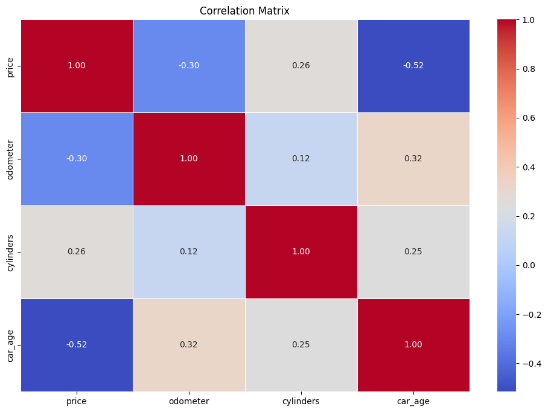
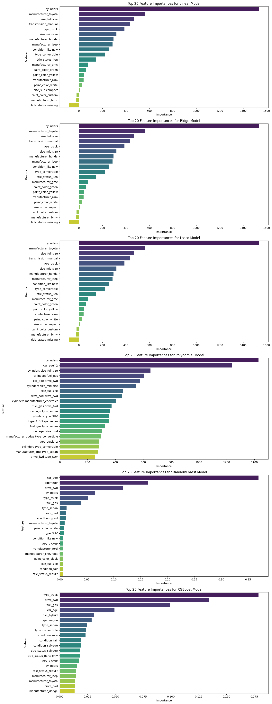
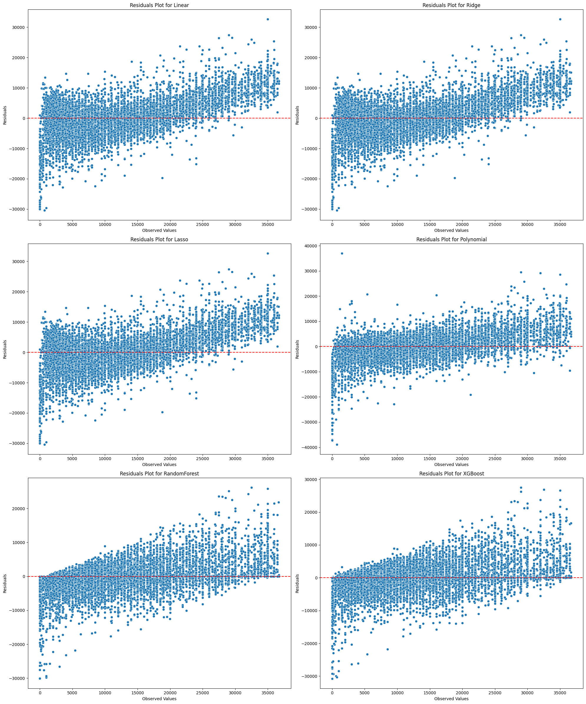

# Used Car Price Prediction Analysis Report
## Executive Summary
This report presents an analysis of factors that influence the prices of used cars, based on a dataset of 426,000 vehicles. Our goal was to identify key drivers of car prices to help fine-tune inventory management and pricing strategies. Various regression models, including Linear, Ridge, Lasso, Polynomial, Random Forest, and XGBoost, were utilized to understand the relationships between car features and their prices. Key findings indicate that features such as the number of cylinders, car age, and brand significantly impact car prices.

## Business Understanding
The primary objective of this analysis is to determine the factors that drive the price of used cars. By understanding these key drivers, the dealership can optimize their inventory selection and pricing strategies to maximize profits and meet consumer demands more effectively. The insights from this analysis will help identify which car features are most valued by customers and should be prioritized in inventory decisions.

## Data Cleaning and Preprocessing
- **Missing Values**: Replaced 'other' and 0 values with NaN, then dropped rows with missing values.
- **High Cardinality Features**: Dropped features with high cardinality such as 'model', 'region', and 'state'.
- **Outliers**: Removed outliers in the 'price' and 'year' columns using the Interquartile Range (IQR) method.
- **Feature Transformation**: Applied log transformation to the 'odometer' feature for normalization.
- **New Feature**: Added 'car_age' feature by subtracting the year of the car from the current year.

## Exploratory Data Analysis (EDA)
- **Distribution of Numerical Features**: Key numerical features such as price, cylinders, odometer, and car_age were analyzed to understand their distributions.
- **Categorical Feature Distributions**: Examined the counts of car makes, conditions, fuel types, title status, transmission, drive type, size, type, and paint color.
- **Relationships with Price**: 
  - Car make (e.g., BMW and GMC have higher average prices).
  - Number of cylinders (e.g., cars with more cylinders tend to be more expensive).
  - Fuel type (e.g., diesel cars are priced higher on average).
  - Transmission type (manual vs automatic).

## Model Training and Evaluation
- **Models Used**: Linear, Ridge, Lasso, Polynomial, Random Forest, and XGBoost.
- **Best Parameters**:
  - Ridge: alpha = 0.0001
  - Lasso: alpha = 0.0001, max_iter = 5000
  - Polynomial: degree = 2, alpha = 700
  - RandomForest: max_depth = 50, n_estimators = 500
  - XGBoost: learning_rate = 0.1, max_depth = 13, n_estimators = 500

## Feature Importance
- **Top Features Across Models**:
  - **Cylinders**: Consistently the most important feature across all models.
  - **Car Age**: Especially significant in Polynomial and ensemble models.
  - **Manufacturer**: Toyota, Honda, Jeep, etc., have a notable impact on price.
  - **Transmission and Drive Type**: Manual transmission and drive types (fwd, rwd) are significant.
  - **Fuel Type and Size**: Fuel type (gas, diesel) and size (full-size, mid-size) are crucial.

## Model Performance
- **Evaluation Metrics**:
  - Mean Absolute Error (MAE)
  - Root Mean Squared Error (RMSE)
  - R-squared (R²)

| Model         | MAE          | RMSE         | R²        |
|---------------|--------------|--------------|-----------|
| Linear        | 3728.92      | 5159.58      | 0.6156    |
| Ridge         | 3728.92      | 5159.58      | 0.6156    |
| Lasso         | 3728.92      | 5159.58      | 0.6156    |
| Polynomial    | 2882.77      | 4279.48      | 0.7356    |
| RandomForest  | 2195.94      | 3511.36      | 0.8219    |
| XGBoost       | 2171.80      | 3565.80      | 0.8164    |

## Findings and Actionable Items
1. **Cylinders**: Cars with more cylinders tend to have higher prices. 
   - **Action**: Stock more vehicles with higher cylinder counts (e.g., V6, V8) as they command higher prices.

2. **Car Age**: Newer cars (lower car age) generally have higher prices.
   - **Action**: Prioritize acquiring newer cars for inventory to attract higher pricing.

3. **Manufacturer**: Brands like Toyota, Honda, and Jeep significantly influence car prices.
   - **Action**: Focus on stocking popular brands known to have higher resale values.

4. **Transmission and Drive Type**: Manual transmission and drive types (fwd, rwd) are significant price influencers.
   - **Action**: Highlight these features in sales pitches and listings to justify premium pricing.

5. **Fuel Type and Size**: Diesel vehicles and larger cars (full-size, mid-size) have higher prices.
   - **Action**: Acquire more diesel vehicles and larger-sized cars to meet customer preferences for these higher-value features.

## Next Steps and Recommendations
1. **Inventory Selection**:
   - Continue to prioritize high-cylinder count cars, popular brands, and newer vehicles.
   - Increase inventory of diesel vehicles and full-sized cars based on higher market value.

2. **Pricing Strategy**:
   - Utilize model insights to set competitive prices, focusing on car age, odometer reading, transmission type, and drive type.

3. **Feature Emphasis**:
   - Highlight important features such as low car age, fuel efficiency, and manual transmission in marketing and sales strategies to attract customers.

4. **Continued Data Analysis**:
   - Regularly update the models with new data to maintain accuracy and adapt to changing market conditions.
   - Conduct periodic reviews of feature importances and model performance to ensure alignment with market trends.

## Conclusion
Our analysis provides a comprehensive understanding of the factors influencing used car prices. By leveraging advanced regression models, we have identified key features that significantly impact prices, enabling the dealership to make informed decisions about inventory and pricing strategies.

## Appendices
- **Correlation Matrix**: Provides a detailed view of the relationships between different numerical features.

- **Feature Importances**: Detailed charts showing the importance of various features across different models.

- **Residual Plots**: Visual representations of model performance and residual distribution.

